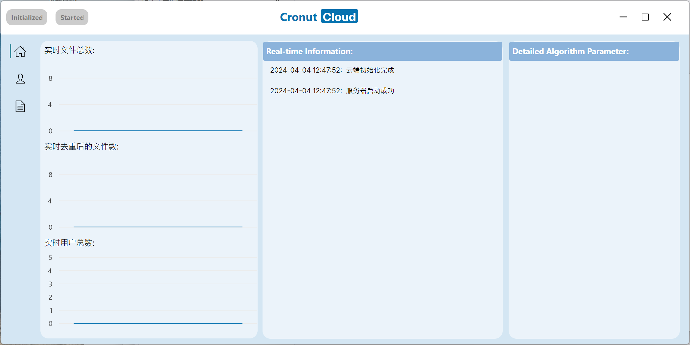
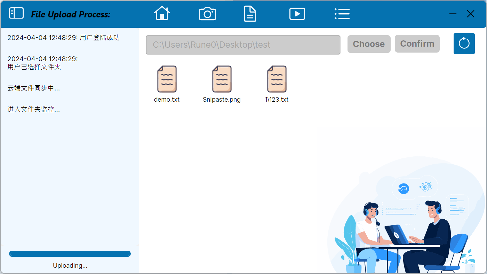
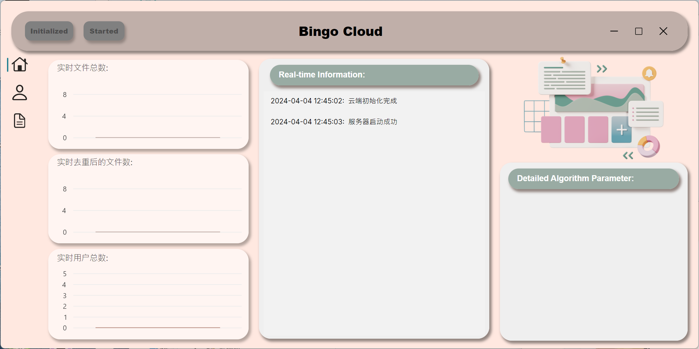
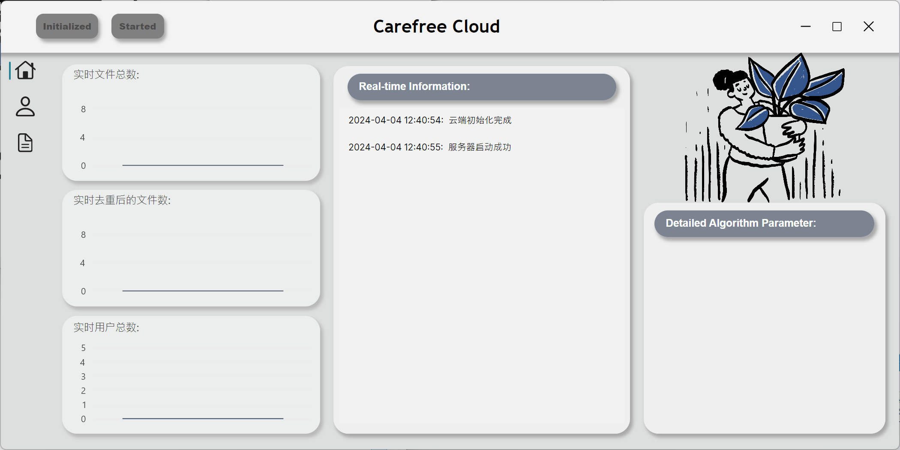
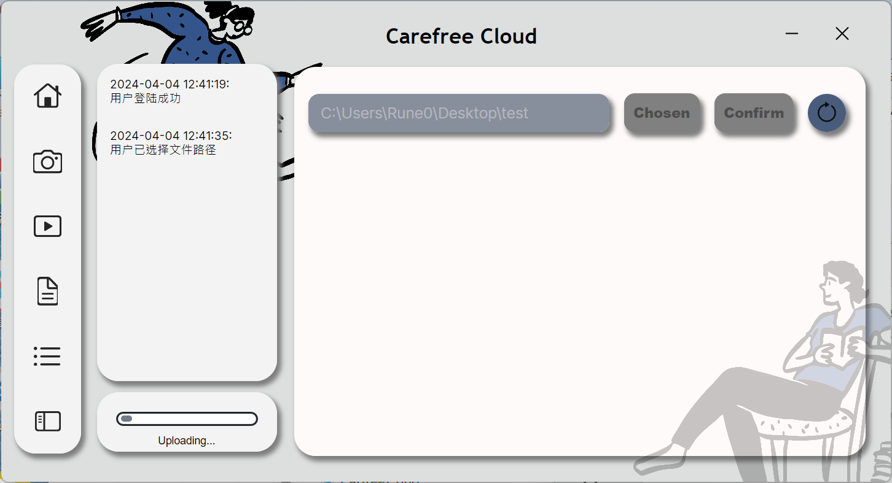

# Cronut-dev

  

### Cronut-dev 是 [Cronut](https://github.com/zhaoruheng/Cronut) 项目的三个前端美化项目，具体项目内容请前往 [Cronut](https://github.com/zhaoruheng/Cronut)

---
### main 分支界面展示

---
### Bingo 分支界面展示

---
### Carefree 分支界面展示

